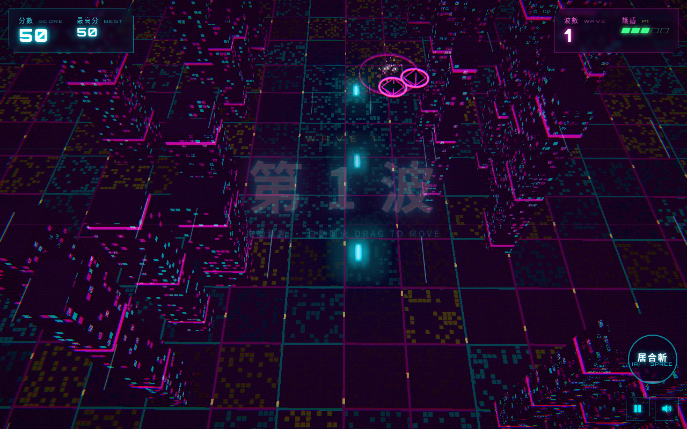

# 賽博忍者：星海魔獸 CYBER NINJA

> 賽博朋克 3D 直向射擊 · cyberpunk 3D vertical shooter · 自動開火 auto-fire · Three.js · 手機優先

**試玩 Play:** https://fung2222.github.io/cyber-ninja/ · **自動示範 Demo:** https://fung2222.github.io/cyber-ninja/?demo=1



## 玩法 How to play
- 喺畫面**任何位置拖動**移動忍者（相對拖動，手指唔會遮住角色）；忍者會**自動開火**。
- 擊破敵機儲能量，儲滿就撳「**居合斬**」—— 一刀清晒全場子彈同雜兵，對巨獸造成重創。
- 每 5 波迎戰**星海魔獸**：環形彈幕、螺旋彈、瞄準連射，血量低於 40% 會暴走。
- 拾取道具：**火力 P**（最多 5 級散射）、**護盾 S**（+1 護盾）、**能量 E**。
- 被擊中會失去 1 格護盾同 1 級火力；護盾歸零就任務失敗，可以睇廣告**復活一次**（網頁版免費）。

## 操作 Controls
| 動作 | 手機 | 鍵盤 |
|---|---|---|
| 移動 Move | 拖動 Drag | ←→↑↓ / WASD |
| 居合斬 Ultimate | 居合斬掣 | Space / Enter / X / J |
| 暫停 Pause | ⏸ | P / Esc |
| 靜音 Mute | 🔊 | M |

## 網址參數 URL flags
`?demo=1` AI 自動玩 · `?fps=1` · `?quality=low` · `?adsim=1` · `?reset=1` · `?mute=1`

## 技術 Tech
Three.js r169 + [cyber-kit](https://github.com/fung2222/cyber-kit) v0.1.0（`vendor/cyber-kit/`），冇 build step，可離線運行。所有模型（忍者、敵機、星海魔獸）都係程式生成嘅原創設計；音效同音樂全部合成。

## 開發 Development
```bash
cd .. && python3 -m http.server 18940     # http://127.0.0.1:18940/cyber-ninja/
node cyber-ninja/tests/waves.test.mjs
python cyber-ninja/tests/smoke.py
```
文件：[docs/HANDOFF.md](docs/HANDOFF.md) · [privacy.html](privacy.html) · 屬於 [CYBER ARCADE](https://github.com/fung2222/cyber-arcade) 系列。
